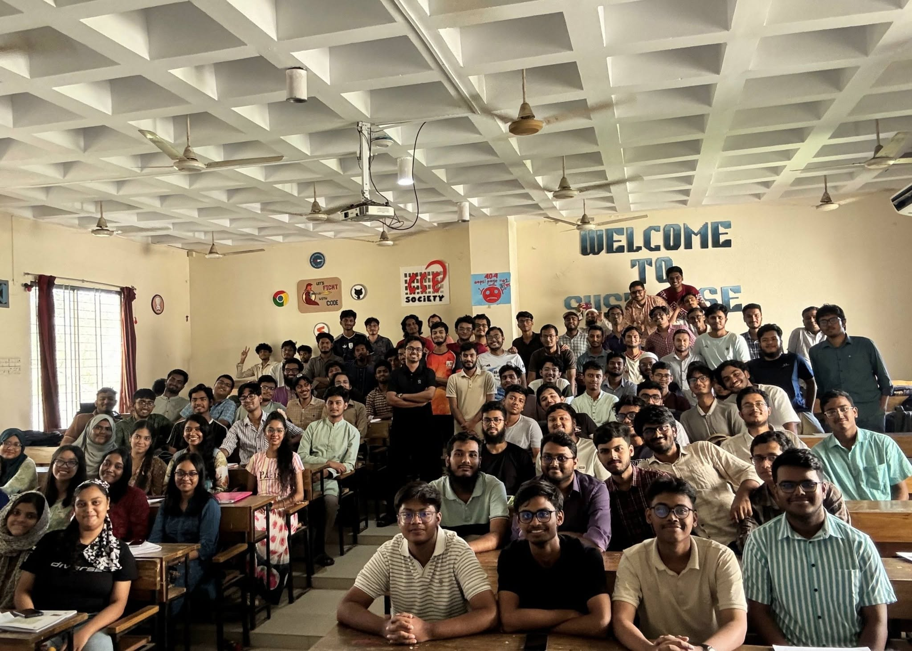

# 25 — Acknowledgments and credits

This resource exists thanks to the guidance of our instructor and the dedicated effort of our peers:

- **Mainul Hasan Mohsin Sir** *(Course Instructor)* — For leading us through Structured Programming Language with patience and clarity, demystifying complex concepts, and making every lecture engaging and approachable.
- **Kohinoor Mahi** *(Class Notes & Content)* — For her meticulous note-taking and tireless effort throughout the semester. Her notes form the backbone of this archive—without her thorough documentation, this platform would not have been possible.
- **Arpon Debnath** *(Digitization & Coordination)* — For photographing, scanning, and organizing the notes, as well as seamlessly coordinating the workflow to bring these materials online.

---

Back to [[index|Course Index]].
