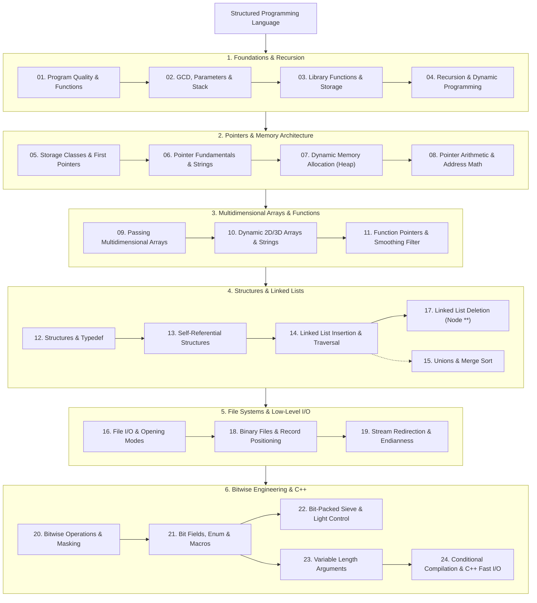

# Structured Programming Language (SPL)

> [!abstract] Course Knowledge Base & Learning Hub
> **Course**: Structured Programming Language (SPL)  
> **Language Focus**: C (C11 / C17 / C23) & Modern C++ Transition  
> **Textbook References**: E. Balagurusamy (*Programming in ANSI C*), Deitel & Deitel (*C How to Program*)  
> **Scope**: Complete lecture and lab notes spanning fundamental program design, memory architecture, pointers, dynamic allocation, linked lists, file systems, bitwise manipulation, and competitive programming fast I/O.

---

## 🏛️ Knowledge Base Pillars

The course curriculum is structured into six comprehensive modules:

> [!summary] 🧱 [[01 - Program quality and functions|1. Foundations & Recursion]]
> **Lectures 01 – 04** — Program design philosophy, algorithmic efficiency, and divide-and-conquer.
> - **01**: [[01 - Program quality and functions|Program Quality & Functions]] — The 8 clarity rules, function prototypes, declarations vs definitions.
> - **02**: [[02 - GCD, parameters and recursion|GCD, Parameters & Recursion]] — Brute force vs Euclidean algorithm, call stacks, recursive sums.
> - **03**: [[03 - Library functions, strings and storage|Library Functions, Strings & Storage]] — `<math.h>`, string handling, stack vs global data memory limits.
> - **04**: [[04 - Recursion and dynamic programming|Recursion & Dynamic Programming]] — Fibonacci analysis, Tower of Hanoi ($2^n-1$), memoization vs tabulation, stairs problem.
> 
> 👉 **[[01 - Program quality and functions|Start Module 1 →]]**

> [!tip] 🧠 [[05 - Storage, preprocessor, arrays and first pointers|2. Pointers & Memory Architecture]]
> **Lectures 05 – 08** — Hardware memory model, storage durations, and raw pointer mechanics.
> - **05**: [[05 - Storage, preprocessor, arrays and first pointers|Storage, Preprocessor & First Pointers]] — `static`, `extern`, base conversion, multi-file linking, first pointer model.
> - **06**: [[06 - Pointer fundamentals and strings|Pointer Fundamentals & Strings]] — Dereferencing, `void *`, `const` pointer qualifiers, substring vs subsequence, `strstr`.
> - **07**: [[07 - Dynamic memory allocation|Dynamic Memory Allocation]] — Memory segments (Stack, Heap, BSS, Code), `malloc`, `calloc`, safe `realloc`, matrix multiplication.
> - **08**: [[08 - Pointer arithmetic and multidimensional arrays|Pointer Arithmetic & Multidimensional Arrays]] — Precedence (`*p++`), byte inspection, 2D/3D/4D address calculation formulas.
> 
> 👉 **[[05 - Storage, preprocessor, arrays and first pointers|Start Module 2 →]]**

> [!note] 📐 [[09 - Passing multidimensional arrays|3. Advanced Matrices & Function Pointers]]
> **Lectures 09 – 11** — Dimensional decay, dynamic multidimensional buffers, and callback functions.
> - **09**: [[09 - Passing multidimensional arrays|Passing Multidimensional Arrays]] — `arr` vs `arr[0]` vs `&arr`, passing 2D/3D arrays, pointer to matrix `int (*pt)[R][C]`.
> - **10**: [[10 - Dynamic arrays and strings|Dynamic Arrays & Strings]] — Array of row pointers (`int **`), jagged arrays, dynamic 3D arrays, dynamic string buffers.
> - **11**: [[11 - Function pointers and review|Function Pointers & Review]] — 3×3 matrix smoothing filter, function pointers as callbacks, pointer review.
> 
> 👉 **[[09 - Passing multidimensional arrays|Start Module 3 →]]**

> [!example] 🔗 [[12 - Structures and typedef|4. Structures & Linked Lists]]
> **Lectures 12 – 15, 17** — User-defined composite types, self-referential structures, and dynamic node linking.
> - **12**: [[12 - Structures and typedef|Structures & Typedef]] — Member access, nested structures, array of structures, index-preserving bubble sort.
> - **13**: [[13 - Structure pointers and self-referential structures|Structure Pointers & Self-Referential Structures]] — Arrow operator `->`, self-referential definitions, transition to linked lists.
> - **14**: [[14 - Linked list creation, insertion and traversal|Linked List Creation, Insertion & Traversal]] — `create_node`, insert last/first/position, linear traversal, search.
> - **15**: [[15 - Unions and merge sort|Unions & Merge Sort]] — Memory sharing in `union`, divide-and-conquer merge sort algorithm.
> - **17**: [[17 - Linked list deletion and pointer parameters|Linked List Deletion & Pointer Parameters]] — Delete head/tail/position, why pointer-to-pointer (`Node **`) is necessary.
> 
> 👉 **[[12 - Structures and typedef|Start Module 4 →]]**

> [!check] 💾 [[16 - File IO and opening modes|5. File Systems & Low-Level I/O]]
> **Lectures 16, 18, 19** — Persistent storage streams, binary record access, and machine endianness.
> - **16**: [[16 - File IO and opening modes|File I/O & Opening Modes]] — Buffering mechanics, `FILE *`, opening modes (`"r"`, `"w"`, `"r+"`), formatted `fscanf`/`fprintf`.
> - **18**: [[18 - Binary files, positioning and record access|Binary Files & Record Access]] — `fwrite`/`fread`, file positioning (`fseek`, `ftell`, `rewind`), relative vs absolute paths.
> - **19**: [[19 - Stream redirection, endianness and register|Stream Redirection, Endianness & Register]] — `freopen`, Big Endian vs Little Endian memory layouts, `register` storage class.
> 
> 👉 **[[16 - File IO and opening modes|Start Module 5 →]]**

> [!important] ⚡ [[20 - Bitwise operations and masking|6. Bitwise Engineering & C++ Transition]]
> **Lectures 20 – 24** — Hardware bit masking, bit-packed data structures, variadic arguments, and modern C++.
> - **20**: [[20 - Bitwise operations and masking|Bitwise Operations & Masking]] — Bitwise logic (`&`, `|`, `^`, `~`, `<<`, `>>`), bit manipulation: Set, Clear, Toggle, and Check.
> - **21**: [[21 - Bit fields, enumeration and macros|Bit Fields, Enumeration & Macros]] — `unsigned flag : 1`, `enum`, command line arguments (`argc`/`argv`), multiline macros.
> - **22**: [[22 - Bit-packed sieve and light control|Bit-Packed Sieve & Light Control]] — Sieve of Eratosthenes, packing 32 marks into an integer (`n/32` and `n%32`), room light switches.
> - **23**: [[23 - Variable length arguments|Variable Length Arguments]] — Ellipsis `...`, `<stdarg.h>`, `va_list`, `va_start`, `va_arg`, `va_end`, sentinel processing.
> - **24**: [[24 - Conditional compilation and introduction to C++|Conditional Compilation & Intro to C++]] — `#ifdef LOCAL`, header guards, `iostream`, namespaces, competitive programming fast I/O (`sync_with_stdio(false)`, `cin.tie(nullptr)`).
> 
> 👉 **[[20 - Bitwise operations and masking|Start Module 6 →]]**

---

## 🗺️ Master Curriculum Roadmap

---

## 📚 Complete Lecture Index

| Lecture | Topic Title | Core Concepts |
| :---: | :--- | :--- |
| **01** | [[01 - Program quality and functions]] | Integrity, Clarity (8 rules), Simplicity, Functions, Prototypes vs Declarations |
| **02** | [[02 - GCD, parameters and recursion]] | GCD (Brute Force vs Euclidean), Pass by Value, Call Stack (LIFO), Recursion |
| **03** | [[03 - Library functions, strings and storage]] | Math Library (`sin`, `asin`, `pow`), Strings (`strcpy`), Storage Classes, Stack vs Global Limits |
| **04** | [[04 - Recursion and dynamic programming]] | Factorial, LCM, Fibonacci Call Counts, Tower of Hanoi, DP Memoization & Tabulation, Stair Climbing |
| **05** | [[05 - Storage, preprocessor, arrays and first pointers]] | `auto`, `static`, `extern`, Base 5 Arithmetic, Multi-file Compilation, 2D Matrix Addition, First Pointer |
| **06** | [[06 - Pointer fundamentals and strings]] | `&` and `*`, `sizeof`, `void *`, `const` Pointer Qualifiers, Array Reverse, Substrings vs Subsequences |
| **07** | [[07 - Dynamic memory allocation]] | Memory Segments (Stack, Heap, BSS, Code), `malloc`, `calloc`, `memset`, Safe `realloc`, Matrix Multiply |
| **08** | [[08 - Pointer arithmetic and multidimensional arrays]] | Precedence (`*p++`), Byte Inspection, Row-Major 2D/3D/4D Address Calculations, Base Recovery |
| **09** | [[09 - Passing multidimensional arrays]] | `arr` vs `arr[0]` vs `&arr`, Passing 2D/3D Arrays, Pointer to Entire Matrix `int (*pt)[3][5]`, Array Decay |
| **10** | [[10 - Dynamic arrays and strings]] | Array Decay, Dynamic 2D Row Pointers (`int **`), Jagged Arrays, Dynamic 3D, Dynamic Strings |
| **11** | [[11 - Function pointers and review]] | 3×3 Matrix Smoothing Filter, Function Pointers, Callbacks, Pointer Review, Array Concatenation |
| **12** | [[12 - Structures and typedef]] | Structure Definition, Member Access (`.`), Nested Structures, Array of Structures, Bubble Sort with Index |
| **13** | [[13 - Structure pointers and self-referential structures]] | Structure Pointers (`->`), Self-Referential Structures, Memory Nodes, Transition to Linked Lists |
| **14** | [[14 - Linked list creation, insertion and traversal]] | `Node` Struct, `create_node`, Insert Last/First/Position, List Traversal, Linear Search |
| **15** | [[15 - Unions and merge sort]] | String Assignment Rules, Singly/Doubly/Circular Lists, `union` Storage Sharing, Recursive Merge Sort |
| **16** | [[16 - File IO and opening modes]] | File Buffer, `FILE *`, Opening Modes (`"r"`, `"w"`, `"r+"`), Formatted Stream I/O (`fscanf`, `fprintf`) |
| **17** | [[17 - Linked list deletion and pointer parameters]] | Delete Last, Delete First, Delete at Position, Double Pointer Parameter (`Node **start`) |
| **18** | [[18 - Binary files, positioning and record access]] | Binary Streams, `fwrite`, `fread`, Positioning (`fseek`, `ftell`, `rewind`), Absolute vs Relative Paths |
| **19** | [[19 - Stream redirection, endianness and register]] | `freopen` Stream Redirection, Big Endian vs Little Endian Memory Boxes, `register` Storage Class |
| **20** | [[20 - Bitwise operations and masking]] | Bitwise Operators (`&`, `\|`, `^`, `~`, `<<`, `>>`), Masking, 4 Bit Operations (Set, Clear, Toggle, Check) |
| **21** | [[21 - Bit fields, enumeration and macros]] | Bit Fields (`unsigned flag : 1`), `enum`, Command Line Arguments (`argc`, `argv`), Multiline Macros |
| **22** | [[22 - Bit-packed sieve and light control]] | Sieve of Eratosthenes, Storing 32 Marks per Integer (`n / 32`, `n % 32`), Room Light Control |
| **23** | [[23 - Variable length arguments]] | Ellipsis `...`, `<stdarg.h>`, `va_list`, `va_start`, `va_arg`, `va_end`, Sentinel Traversal |
| **24** | [[24 - Conditional compilation and introduction to C++]] | Header Guards (`#ifndef`), `#ifdef LOCAL`, C++ Streams (`cin`, `cout`), Namespaces, Fast I/O Decoupling |
