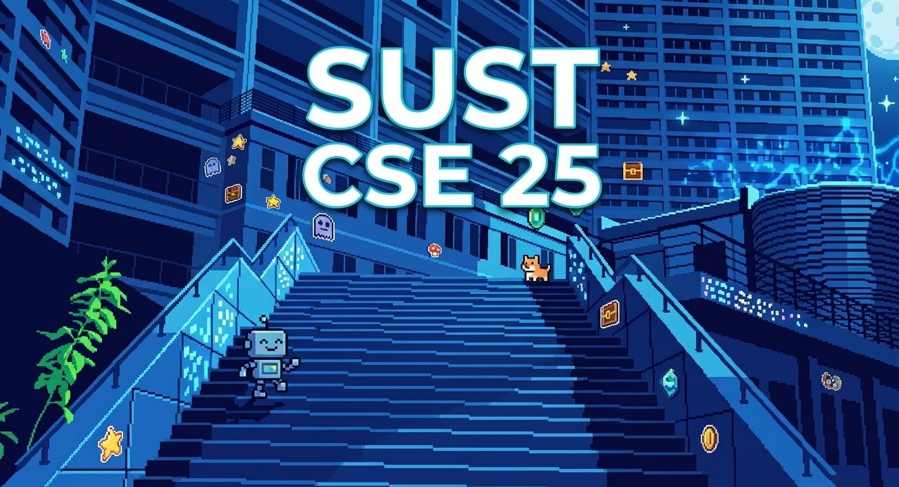

# Structured Programming Language

## Contents

1. [[01 - Program quality and functions|Program quality and functions]]
2. [[02 - GCD, parameters and recursion|GCD, parameters and recursion]]
3. [[03 - Library functions, strings and storage|Library functions, strings and storage]]
4. [[04 - Recursion and dynamic programming|Recursion and dynamic programming]]
5. [[05 - Storage, preprocessor, arrays and first pointers|Storage, preprocessor, arrays and first pointers]]
6. [[06 - Pointer fundamentals and strings|Pointer fundamentals and strings]]
7. [[07 - Dynamic memory allocation|Dynamic memory allocation]]
8. [[08 - Pointer arithmetic and multidimensional arrays|Pointer arithmetic and multidimensional arrays]]
9. [[09 - Passing multidimensional arrays|Passing multidimensional arrays]]
10. [[10 - Dynamic arrays and strings|Dynamic arrays and strings]]
11. [[11 - Function pointers and review|Function pointers and review]]
12. [[12 - Structures and typedef|Structures and typedef]]
13. [[13 - Structure pointers and self-referential structures|Structure pointers and self-referential structures]]
14. [[14 - Linked list creation, insertion and traversal|Linked list creation, insertion and traversal]]
15. [[15 - Unions and merge sort|Unions and merge sort]]
16. [[16 - File IO and opening modes|File IO and opening modes]]
17. [[17 - Linked list deletion and pointer parameters|Linked list deletion and pointer parameters]]
18. [[18 - Binary files, positioning and record access|Binary files, positioning and record access]]
19. [[19 - Stream redirection, endianness and register|Stream redirection, endianness and register]]
20. [[20 - Bitwise operations and masking|Bitwise operations and masking]]
21. [[21 - Bit fields, enumeration and macros|Bit fields, enumeration and macros]]
22. [[22 - Bit-packed sieve and light control|Bit-packed sieve and light control]]
23. [[23 - Variable length arguments|Variable length arguments]]
24. [[24 - Conditional compilation and introduction to C++|Conditional compilation and introduction to C++]]
25. [[25 - Acknowledgments and credits|Acknowledgments and credits]]
